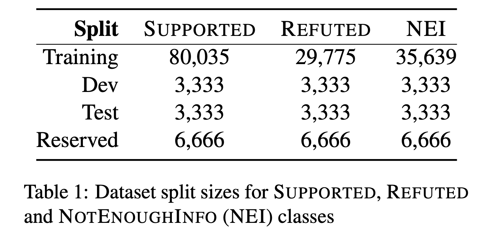
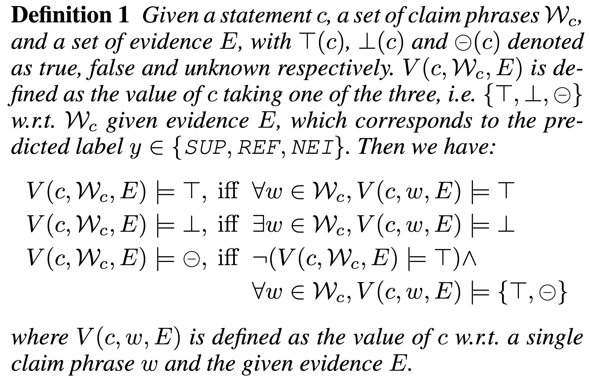
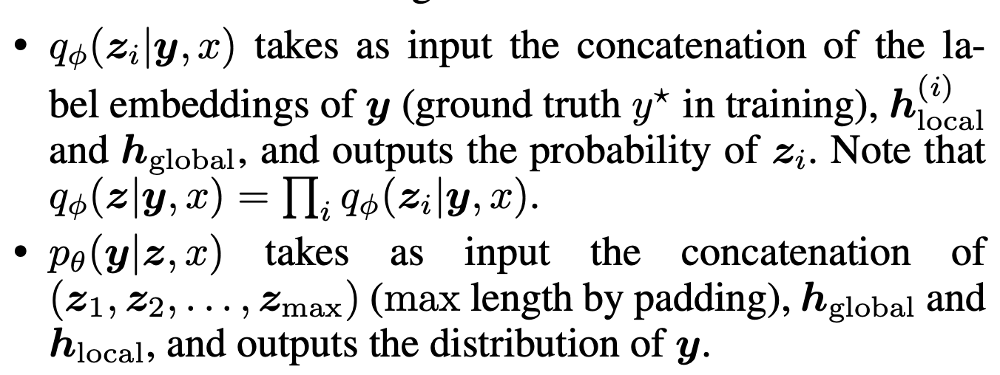
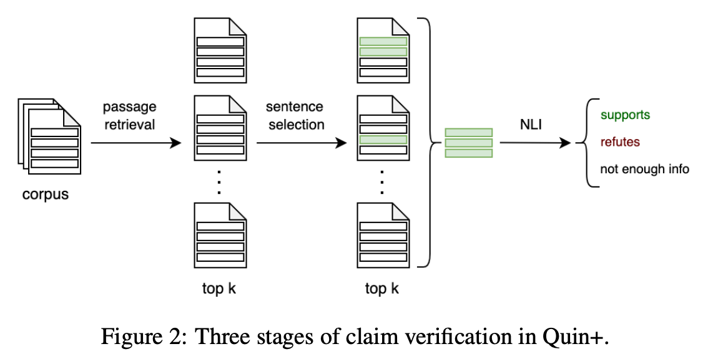

# Automated Fact-Checking under Fact Extraction and VERification (FEVER) Shared Task

## Task Definition
The first Fact Extraction and VERification (FEVER) shared task was proposed by [FEVER: a Large-scale Dataset for Fact Extraction and VERification (Thorne et al., 2018)](https://aclanthology.org/N18-1074/), which consists of three stages: 1) Document Retrieval; 2) Sentence Selection; 3) Recognizing Textual Entailment.

## Dataset Statistics

## Evaluation
TODO
## Keys
### Claim Generation
1. June 2017 Wikipedia dump, processed it with Stanford CoreNLP.->
2. Sampled sentences from the **introductory** sections of approximately 50,000 popular pages and  5,000 from a Wikipedia **most accessed pages** list and **the pages hyperlinked from them**(for multi-hop cases).->
3. Given a sentence from the sample (i.e. step 2) chosen at random,-> generating *a set of claims*  -> introducing a dictionary as additional information to increase the complexity of the generated claims in a controlled manner: a list of terms that were (hyper-)linked in the original sentence, along with the first sentence from their corresponding Wikipedia pages.
4. Six types of mutation: paraphrasing, negation, substitution of an entity/relation with a similar/dissimilar one, and making the claim more general/specific.
5. A mean length of 9.4 tokens
### Claim Labeling
1. Label each individual claim generated during Claim Generation(#Claim Generation) as **SUPPORTED**, **REFUTED** or **NOTENOUGHINFO**.
2. What sentences can be selected as evidences (which means no IR process for annotators): \
	2.1.  all sentences from the introductory section *of the page* for the main entity and *of every linked entity* in those sentences\
	2.2. all sentences from the introductory section *of any arbitrary pages* added by annotators\
	2.3. the title of the page(not explicitly recorded)
### Dataset split
1. Each Wikipedia page used to generate claims occurs in exactly one set.
2. Extra 19,998 examples for use as a test set for a shared task(i.e., reserved).

## Follow 3-steps pipeline
## Overview
TODO
### Contribution on claim verification
#### LOREN: Logic-Regularized Reasoning for Interpretable Fact Verification
Publication venue: AAAI 2022 \
Paper: [paper](https://arxiv.org/pdf/2012.13577.pdf) \
Code: [code](https://github.com/jiangjiechen/LOREN) \
Main contribution lies on claim verification
##### Intuition
The veracity of a claim depends on the truthfulness of its composing phrases, e.g., subject, verb, object phrases.  
The claim is valid if all phrases are supported by certain evidence sentences in Wikipedia. \
All phrases should be supported if a claim is true, and a claim is refuted if there exists at least one false phrase. If the outcome of a claim is unverifiable, then there must be no refuted phrase and at least one phrase that should be verified as unverifiable.
#### Methodology
1. Claim Verification

2. Phrase Verification
	Extract claim phrases Wc with a set of heuristic rules using a series of off-the-shelf tools provided by AllenNLP: named entities (NEs), verbs, adjective and noun phrases (APs and NPs).
	
3. Logical Constraints
	
	| Label | Constraint |
	| ----- | ---------- |
	| REF.| if at least one claim phrase is refuted by evidence|
	| SUP.|if all claim phrases are supported|
	|NEI|neither of the above but at least one phrase gets unknown outcome. |
	
	Note: *The checking rule for the REF judgment has priority over NEI in phrase level  as it is also possible for a phrase to be NEI in a refuted claim, but not vice versa.* \
	Formal Def.	
	
	
	
4. Latent model: \
	4.1. Variational inference; \
	4.2. Use an off-the-shelf and pre-trained NLI model as prior distribution p(z|x), whose parame-ters are fixed. The NLI model yields the distribution of *contradicted*, *neutral* and *entailment*, which correspond to REF, NEI and SUP to some extent.
	
5. Logical Knowledge Distillation \
	5.1. Student model:  \
	5.2. Teacher model: project variational distribution  into a subspace, denoted as  which is constrained by the logical rules, since yz  is the logical aggregation of z. \
	5.3. Distillation Loss \
	​		
	
6. Building Local Premises （To generate local premise for reasoning)
	
	  6.1. Probing Question Generation

	​	build probing questions Q for **every claim phrase** respectively:

  		1) cloze questions, e.g., [MASK] won the 2020 election.
  		2) interrogative questions, e.g., Who won the 2020 election?

	6.2. Local Premise Construction\
			The MRC model takes as an input Q and E and answers WE. \
			 Then replace the original phrase with the answer to get replaced claims as local premise to reason about the veracity of every claim phrase.\
			 MRC model is trained in the self-supervised fashion and the MRC dataset is built with only SUP samples as REF or NEI samples are untrustworthy.

7. Veracity Prediction\
		Concatenate claim and each local premise, and then encode them into local vector with PLM;\
		Concatenate claim and each evidence sentence, and then encode them into global vector with PLM, followed by a self-selecting module to find the important parts of a vector;\
		A *culprit attention* based on a heuristic observation: a valid local premise should be semantically close to the evidence sentences:
		 ,  
		
	Then pθ(·)  and qφ both are two-layer MLPs:
		
	
		
	Decoding: randomly initialize z, and then iteratively decode y and z with pθ (y|z, x) and qφ(z|y,x) until convergence
#### Reflection
Is it really reasonable that using model A for prediction and model B to interpret model A?\
The constraints seems oversimplified. Is a phrase alone or simple boolean operations enough for verifying claim in the real world?
	
#### Improving Evidence Retrieval for Automated Explainable Fact-Checking
Publication venue: NAACL 2021 \
Paper: [paper](https://aclanthology.org/2021.naacl-demos.10.pdf) \
Code: [code](https://github.com/algoprog/Quin) \
##### Intuition
Expanding FEVER dataset with web search engine; Hybrid passage retrieval; Selection evidence sentences with embedding-based relevance score OR BIO tagging format sequence labeling model; Entailment classification with an NLI model based on RoBERTa-large, Inference: firstly retrieve relevant passages and then classify these passages into refuting/support, finally determine the label based on the number of refuting/support passages.
#### Methodology

