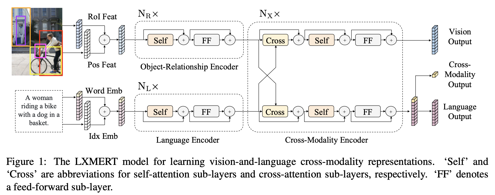
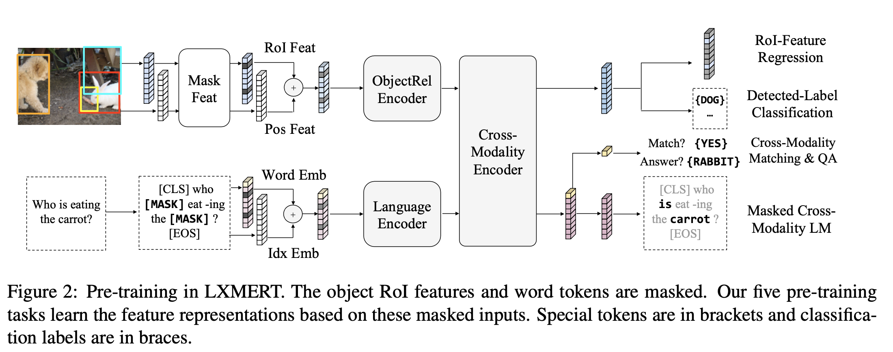

1. LXMERT: Learning Cross-Modality Encoder Representations from Transformers
Publication venue: EMNLP 2019 \
Paper: [paper](https://arxiv.org/pdf/1908.07490.pdf) \
Code: [code](https://github.com/airsplay/lxmert) \
Framework:

    
    
    Pre-training: \
    

2. Repurpose Image Identification for Fake News Detection
Publication venue: DEXA 2021 \
Paper: [paper](https://link.springer.com/chapter/10.1007/978-3-030-86475-0_4) \
Framework:
    
    
    Networks: \
    
