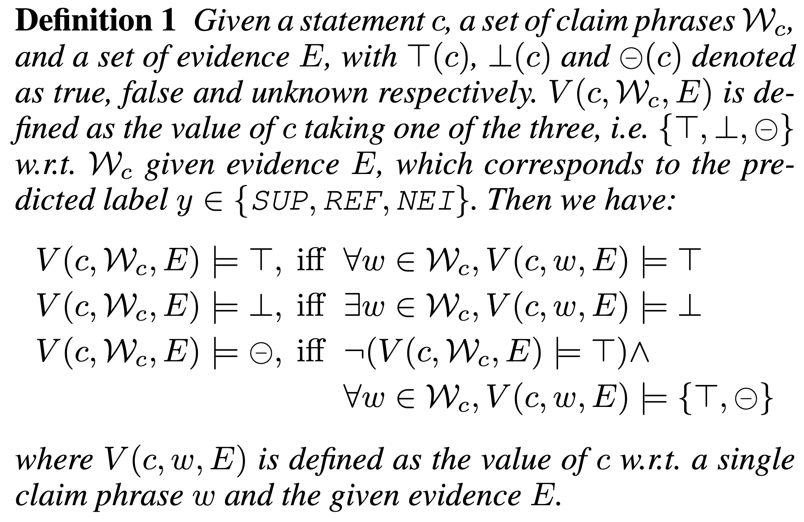

1. LXMERT: Learning Cross-Modality Encoder Representations from Transformers
Publication venue: EMNLP 2019 \
Paper: [paper](https://arxiv.org/pdf/1908.07490.pdf) \
Code: [code](https://github.com/airsplay/lxmert) \

